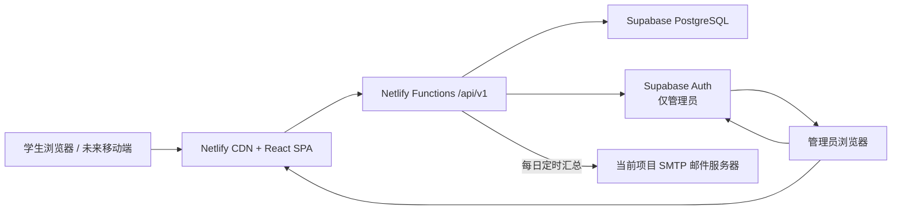
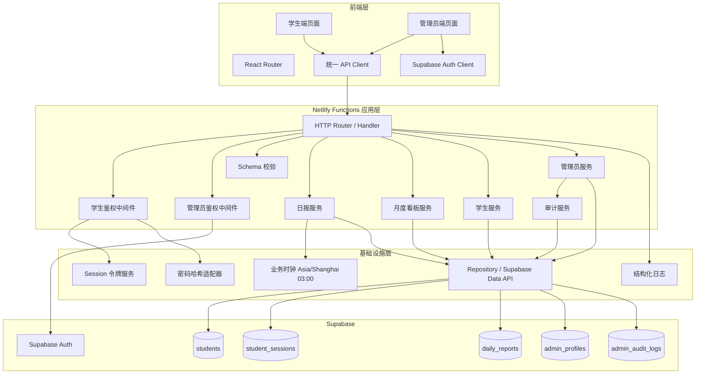
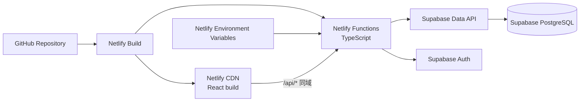
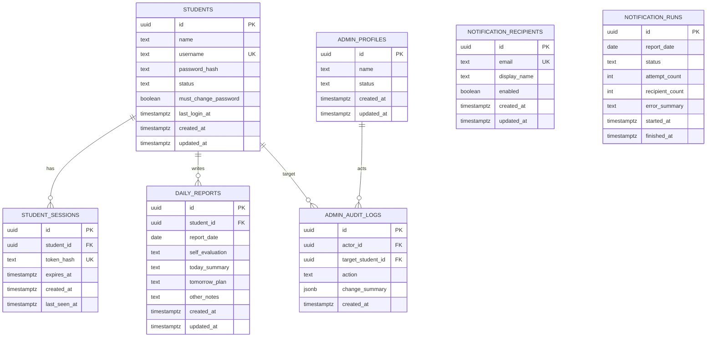
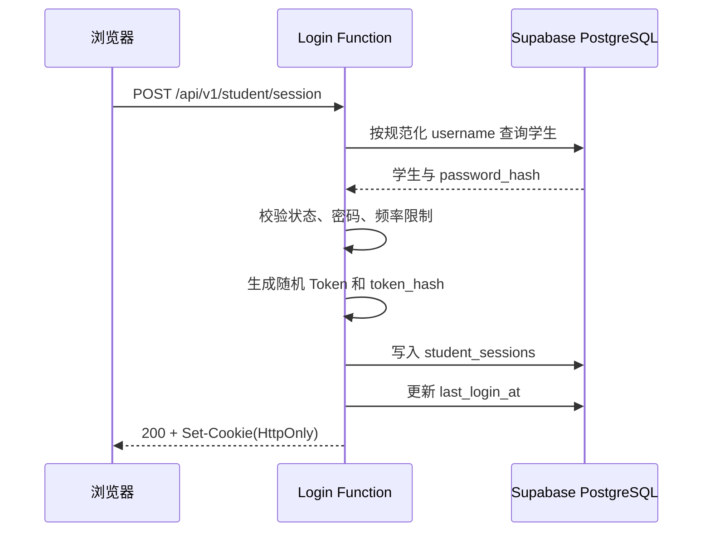
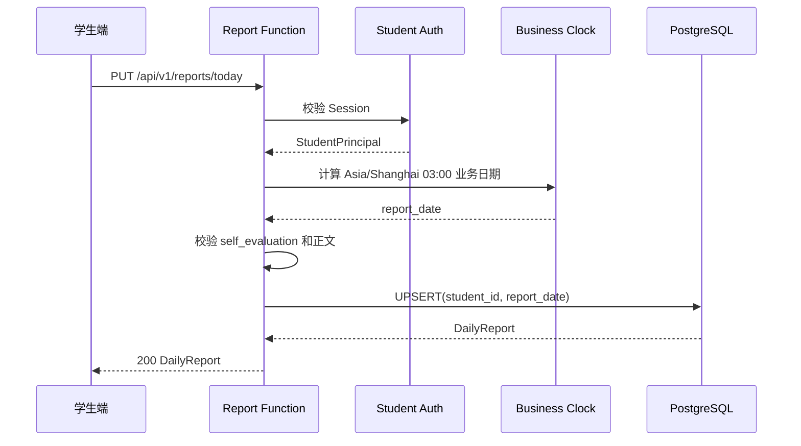
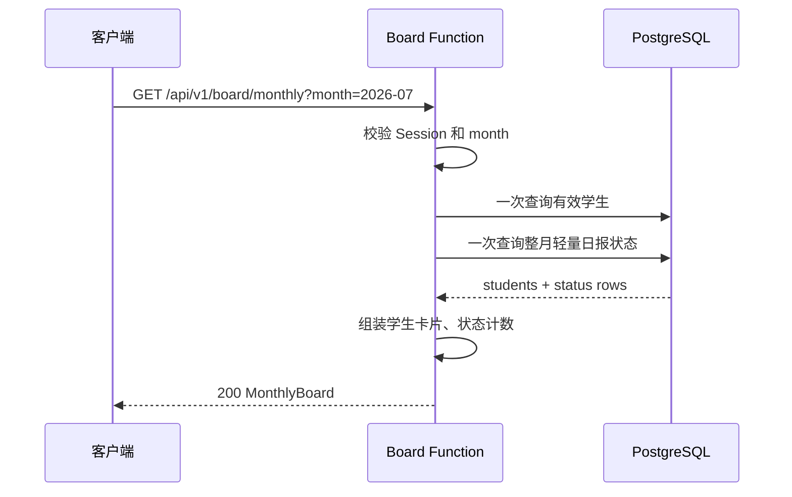
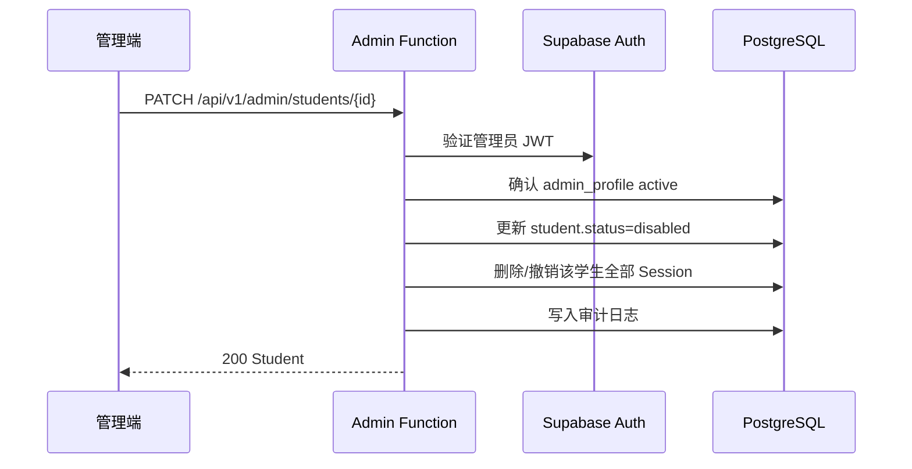
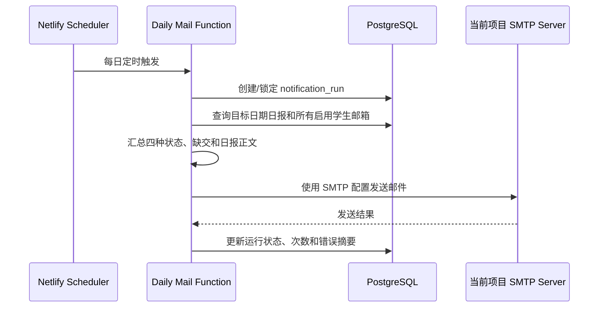

# 学生简易日报系统架构设计

> 版本：V1.1  
> 日期：2026-07-23  
> 状态：目标架构设计  
> 关联文档：[需求分析文档](./需求分析文档.md)、[API 接口文档](./API接口文档.md)、[OpenAPI 规范](./openapi.yaml)

## 1. 设计目标

本设计把现有 React + Flask + SQLite 系统重构为：

- React 单页应用部署于 Netlify；
- TypeScript Netlify Functions 承载全部业务 API；
- Supabase PostgreSQL 保存学生、会话、日报和审计数据；
- 学生使用用户名、密码和固定 30 天的服务端 Session，不使用 Supabase Auth；
- 管理员使用 Supabase Auth，管理接口验证 Supabase JWT；
- 主看板使用按月翻页的 GitHub Contributions 风格活动格；
- Web 与未来移动端共用版本化 JSON API。

架构优先追求：部署简单、权限边界清楚、迁移风险可控、移动端可扩展，而不是引入微服务复杂度。

## 2. 架构原则

1. **服务端统一访问数据**：学生业务表不向浏览器直接开放。
2. **两套身份、一个授权入口**：学生 Session 与管理员 Supabase JWT 分离，在 Functions 中统一转换为调用者上下文。
3. **模块化单体**：按领域拆分代码，共享鉴权、校验、数据库和错误处理，不拆成独立服务。
4. **API 优先**：页面只消费 `/api/v1`，不依赖数据库结构或桌面布局。
5. **无状态计算、有状态存储**：Functions 不保存进程内会话，状态全部进入 PostgreSQL。
6. **按月聚合、按需取详情**：看板接口返回轻量状态数据，正文由详情接口获取。
7. **默认安全**：最小权限、同站 Cookie、服务端密钥、审计日志、统一输入校验。
8. **新系统独立运行**：不提供旧平台、旧接口、旧 Session、旧密码哈希或旧数据兼容层。

## 3. 系统上下文



### 3.1 外部参与者

| 参与者 | 身份方式 | 主要能力 |
| --- | --- | --- |
| 学生 Web | `student_session` HttpOnly Cookie | 登录、看板、日报、个人工作详情、修改本人密码 |
| 未来移动端 | 预留 Bearer Token 适配器 | 与学生 Web 相同的业务能力 |
| 管理员 Web | Supabase Access Token | 学生账号管理、会话撤销、审计查询 |
| Netlify | 静态托管、Functions、Scheduled Functions | 页面发布、API 运行、定时任务 |
| Supabase | PostgreSQL、管理员 Auth | 数据持久化、管理员身份 |

## 4. 逻辑架构



## 5. 模块边界

### 5.1 前端模块

| 模块 | 职责 |
| --- | --- |
| `student-auth` | 学生登录、退出、Session 恢复、路由保护 |
| `reports` | 今日日报读取、编辑、提交、正文展示 |
| `monthly-board` | 月份切换、学生搜索、月度贡献格、单日详情 |
| `person-timeline` | 单个学生在时间段内的日报连续展示 |
| `admin-auth` | Supabase 管理员登录、Token 获取、管理员路由保护 |
| `admin-students` | 学生列表、创建、编辑、启停、临时密码 |
| `shared` | API Client、状态映射、日期工具、错误提示、UI 基础组件 |

### 5.2 Functions 领域模块

| 模块 | 职责 | 不负责 |
| --- | --- | --- |
| `auth/student` | 密码验证、Session 创建/校验/撤销 | 管理员认证 |
| `auth/admin` | Supabase JWT 验证、管理员状态确认 | 学生密码 |
| `students` | 学生资料读取、本人改密 | 日报正文 |
| `reports` | 单日日报、时间段日报、本人 Upsert | 管理员用户创建 |
| `board` | 单月轻量聚合、状态计数 | 返回大段日报正文 |
| `admin/students` | 创建、编辑、启停、临时密码、撤销会话 | 管理员账号自助开通 |
| `audit` | 写入和查询管理操作审计 | 保存密码或令牌 |
| `notifications` | 必选每日邮件、启用学生 BCC 群发、运行记录和手动补发 | 核心在线请求 |

### 5.3 共享基础设施

- `http`：路由、响应封装、请求 ID、CORS/Origin 校验；
- `auth`：学生和管理员鉴权适配器；
- `db`：Supabase 客户端和 Repository；
- `validation`：请求 Schema 和业务校验；
- `errors`：领域错误到 HTTP 状态码的映射；
- `security`：密码哈希、随机令牌、令牌哈希；
- `time`：`Asia/Shanghai` 与 03:00 业务日期；
- `logging`：脱敏结构化日志。

## 6. 推荐代码结构

```text
student-simple-daily-report/
├─ frontend/
│  └─ src/
│     ├─ app/
│     ├─ features/
│     │  ├─ student-auth/
│     │  ├─ reports/
│     │  ├─ monthly-board/
│     │  ├─ person-timeline/
│     │  ├─ admin-auth/
│     │  └─ admin-students/
│     ├─ components/
│     │  └─ MonthActivityCalendar/
│     └─ services/
│        └─ api/
├─ netlify/
│  └─ functions/
│     ├─ api.ts
│     └─ scheduled-daily-report.ts
├─ server/
│  └─ src/
│     ├─ routes/
│     ├─ middleware/
│     ├─ domain/
│     ├─ repositories/
│     ├─ security/
│     ├─ validation/
│     └─ shared/
├─ supabase/
│  └─ migrations/
├─ docs/
│  ├─ 需求分析文档.md
│  ├─ 系统架构设计.md
│  ├─ API接口文档.md
│  └─ openapi.yaml
├─ netlify.toml
└─ package.json
```

`netlify/functions/api.ts` 只负责把请求交给 `server/src` 的应用路由。业务代码不直接散落在 Function 入口中，以便本地测试和未来迁移运行环境。

## 7. 部署架构



### 7.1 路由

建议 `netlify.toml` 规则：

```toml
[[redirects]]
  from = "/api/*"
  to = "/.netlify/functions/api/:splat"
  status = 200

[[redirects]]
  from = "/*"
  to = "/index.html"
  status = 200
```

API Redirect 必须位于 SPA fallback 之前。

### 7.2 环境变量

| 变量 | 可见范围 | 用途 |
| --- | --- | --- |
| `REACT_APP_SUPABASE_URL` | 前端 | 管理员 Supabase Auth |
| `REACT_APP_SUPABASE_ANON_KEY` | 前端 | 管理员 Supabase Auth |
| `SUPABASE_URL` | Functions | 服务端数据访问 |
| `SUPABASE_SERVICE_ROLE_KEY` | Functions | 服务端受信访问，严禁进入前端 |
| `STUDENT_SESSION_COOKIE` | Functions | 默认 `student_session` |
| `STUDENT_SESSION_TTL_SECONDS` | Functions | 固定 `2592000`（30 天），不滑动续期 |
| `ALLOWED_ORIGINS` | Functions | 写请求 Origin 白名单 |
| `LOG_LEVEL` | Functions | 日志级别 |
| `SMTP_SERVER` / `SMTP_PORT` / `EMAIL_ADDRESS` / `EMAIL_PASSWORD` | Scheduled Function | 默认 `smtp.exmail.qq.com:465` + SMTP SSL，沿用当前项目账号配置 |

Deploy Preview 不得连接生产数据库；应使用独立 Supabase 项目或禁止预览环境执行写操作。

## 8. 数据架构

### 8.1 实体关系



所有新业务表使用 UUID，客户端始终将 ID 当作不透明字符串处理。

### 8.2 关键约束

- `students.username`：大小写策略必须固定；建议存储规范化用户名并建立唯一索引。
- `daily_reports(student_id, report_date)`：唯一约束，保证 Upsert 幂等。
- `self_evaluation`：仅允许 `satisfied`、`average`、`dissatisfied`、`other`；历史迁移状态另行归档。
- `student_sessions.token_hash`：唯一，原始 Token 永不入库。
- 学生 Session 自登录起固定 30 天，不滑动续期。
- `must_change_password = true` 时只允许访问 Session、改密和退出接口。
- 停用学生保留日报，但所有有效 Session 立即撤销，且不再出现在任何月份看板或人员详情入口。
- 每日邮件按 `report_date` 建立幂等运行记录，避免定时重试导致重复发送。

### 8.3 索引

```text
students(lower(username)) unique
students(status, name)
student_sessions(token_hash) unique
student_sessions(student_id, expires_at)
daily_reports(student_id, report_date) unique
daily_reports(report_date, student_id)
admin_audit_logs(created_at desc)
admin_audit_logs(target_student_id, created_at desc)
```

### 8.4 数据访问策略

- Functions 使用服务端凭据访问学生业务表；
- 前端匿名密钥不能读取 `students.password_hash` 或 `student_sessions`；
- `admin_profiles` 只允许 Auth 用户读取自己的启用状态；
- 所有管理员写操作仍进入 Functions，以便统一校验和审计；
- Repository 只返回业务所需字段，禁止使用无边界的 `select *`。

## 9. 身份认证与授权

### 9.1 学生登录时序



登录失败统一返回 `AUTH_INVALID_CREDENTIALS`，避免泄露账号是否存在。停用账号可使用同一外部错误，管理员在后台查看真实状态。

### 9.2 学生请求鉴权

1. 从 `student_session` Cookie 读取原始 Token；
2. 计算 SHA-256 或 HMAC 哈希；
3. 查询未过期 Session，并关联启用学生；
4. 生成 `StudentPrincipal`；
5. 路由按资源归属执行授权；
6. 检查 `must_change_password`：为 true 时只允许改密、退出和查询 Session；
7. `last_seen_at` 可按节流策略更新，但不延长固定 30 天的过期时间。

### 9.3 管理员鉴权

1. 前端通过 Supabase Auth 获得 Access Token；
2. 请求携带 `Authorization: Bearer <token>`；
3. Function 使用 Supabase Auth 验证 Token；
4. 查询 `admin_profiles`，确认 `status = active`；
5. 生成 `AdminPrincipal`；
6. 管理写操作完成后写入 `admin_audit_logs`。

学生 Session 永远不能转换为管理员身份；管理员 Token 也不用于学生本人日报写入。

### 9.4 Cookie 策略

```text
student_session=<opaque-token>;
Path=/;
HttpOnly;
Secure;
SameSite=Lax;
Max-Age=2592000
```

- 退出时以 `Max-Age=0` 清除；
- Session 自登录成功起固定 30 天，首期不滑动续期；
- 生产和预览环境 Cookie 名称应隔离；
- 写请求校验 `Origin`；
- 若未来存在跨站嵌入，不直接放宽 `SameSite`，需重新进行 CSRF 设计。

### 9.5 临时密码与强制改密

- 管理员创建学生或重置密码时必须设置 `must_change_password = true`；
- 重置密码可以随时执行，并立即撤销该学生全部 Session；
- 学生用临时密码登录后只能访问 Session、退出和修改密码接口；
- 修改成功后设置 `must_change_password = false`，撤销旧 Session 并签发新的 30 天 Session；
- 新系统不验证或迁移旧平台密码哈希。

## 10. 核心请求流程

### 10.1 提交今日日报



前端不应决定“今天”的业务日期。服务端响应返回实际 `report_date`。

### 10.2 月度看板



看板不得为每个格子单独请求详情。正文只在点击有记录的日期后通过单日详情接口读取。

### 10.3 管理员停用学生



### 10.4 每日邮件任务



- 目标日期按 `Asia/Shanghai` 和 03:00 业务日期规则计算；
- 同一目标日期的自动任务必须幂等，避免重复发送；
- 管理员可以手动补发指定日期，补发生成新的尝试记录；
- 沿用当前项目的 SMTP SSL，默认 `SMTP_SERVER=smtp.exmail.qq.com`、`SMTP_PORT=465`，账号来自 `EMAIL_ADDRESS`、`EMAIL_PASSWORD`；
- 邮件发送失败不能影响在线日报 API。

## 11. 月度看板设计

### 11.1 数据策略

- 一次返回一个月；
- 返回学生基本信息、每天的状态和状态汇总；
- 不返回日报正文；
- 月份使用 `YYYY-MM`；
- 日期使用 ISO `YYYY-MM-DD`；
- 未来日期不计入未提交；
- 停用学生永远不出现在当前或历史月份看板，也不能通过人员详情入口查询。
- 任一已登录学生均可点击启用学生，查看其在新系统中保存的全部历史日报和完整正文。

### 11.2 前端组件

`MonthActivityCalendar` 建议属性：

```ts
type Evaluation = 'satisfied' | 'average' | 'dissatisfied' | 'other';

interface ActivityDay {
  date: string;
  evaluation: Evaluation | null;
  submitted: boolean;
  isFuture: boolean;
}

interface MonthActivityCalendarProps {
  month: string;
  student: { id: string; name: string };
  days: ActivityDay[];
  onDayClick(day: ActivityDay): void;
}
```

组件只负责展示与交互，不请求 API。颜色和中文文案由集中配置提供。

### 11.3 月度看板数据库查询

月度看板必须使用一次聚合查询，不允许先查询学生、再为每个学生分别查询日报。Netlify Function 先把 `YYYY-MM` 转换为当月开始日期和下月开始日期，再调用参数化 SQL：

```sql
WITH active_students AS (
  SELECT id, name
  FROM students
  WHERE status = 'active'
    AND (
      $3::text IS NULL
      OR name ILIKE '%' || $3 || '%'
    )
)
SELECT
  s.id AS student_id,
  s.name AS student_name,
  COALESCE(
    jsonb_agg(
      jsonb_build_object(
        'date', r.report_date,
        'report_id', r.id,
        'self_evaluation', r.self_evaluation
      )
      ORDER BY r.report_date
    ) FILTER (WHERE r.id IS NOT NULL),
    '[]'::jsonb
  ) AS activities,
  COUNT(r.id) AS submitted_count,
  COUNT(*) FILTER (
    WHERE r.self_evaluation = 'satisfied'
  ) AS satisfied_count,
  COUNT(*) FILTER (
    WHERE r.self_evaluation = 'average'
  ) AS average_count,
  COUNT(*) FILTER (
    WHERE r.self_evaluation = 'dissatisfied'
  ) AS dissatisfied_count,
  COUNT(*) FILTER (
    WHERE r.self_evaluation = 'other'
  ) AS other_count
FROM active_students s
LEFT JOIN daily_reports r
  ON r.student_id = s.id
 AND r.report_date >= $1::date
 AND r.report_date < $2::date
GROUP BY s.id, s.name
ORDER BY s.name, s.id;
```

参数：

- `$1`：当月第一天，例如 `2026-07-01`；
- `$2`：下月第一天，例如 `2026-08-01`；
- `$3`：可选学生姓名搜索词。

使用左闭右开区间，不计算“月底 23:59:59”。数据库只返回真实日报；白色未提交格、未来日期和月外补位格由 Function/客户端按月份生成。

查询复杂度近似为 `O(启用学生数 + 当月已提交日报数)`。按 500 名学生估算，单月最多约 15,500 条日报，适合一次聚合返回。必须避免“1 次学生查询 + N 次学生日报查询”的 N+1 模式。

配套索引：

```sql
CREATE INDEX idx_students_active_name
ON students (name, id)
WHERE status = 'active';

CREATE UNIQUE INDEX uq_daily_reports_student_date
ON daily_reports (student_id, report_date);

CREATE INDEX idx_daily_reports_date_student
ON daily_reports (report_date, student_id);
```

姓名模糊搜索数据量较大时再启用 `pg_trgm` GIN 索引。上线前使用生产级样本执行 `EXPLAIN (ANALYZE, BUFFERS)`，确认没有对整张日报表进行无必要全表扫描。

## 12. API 架构

### 12.1 版本

- 当前版本：`/api/v1`；
- 破坏性变更进入 `/api/v2`；
- 新增可选字段不提升主版本；
- 不提供旧平台 `/api` 接口兼容层。

### 12.2 统一响应

成功：

```json
{
  "data": {},
  "meta": {
    "request_id": "req_..."
  }
}
```

失败：

```json
{
  "error": {
    "code": "VALIDATION_ERROR",
    "message": "请求参数不正确",
    "details": [
      { "field": "month", "reason": "必须使用 YYYY-MM 格式" }
    ],
    "request_id": "req_..."
  }
}
```

### 12.3 幂等性

- `PUT /reports/today` 和 `PUT /reports/{date}` 天然按学生与日期幂等；
- 管理员创建学生可接受 `Idempotency-Key`，防止网络重试重复创建；
- 临时密码操作不自动重试；
- 数据库唯一约束作为最终防线。

### 12.4 分页

采用页码分页满足当前规模：

```text
page=1&page_size=20
```

响应 `meta.pagination` 返回 `page`、`page_size`、`total`、`total_pages`。若审计日志规模显著增长，可单独迁移为 Cursor 分页。

## 13. 错误模型

| HTTP | 错误码 | 适用场景 |
| --- | --- | --- |
| 400 | `VALIDATION_ERROR` | 格式或字段校验失败 |
| 401 | `AUTH_REQUIRED` | 未提供有效学生 Session 或管理员 Token |
| 401 | `AUTH_INVALID_CREDENTIALS` | 学生登录失败 |
| 403 | `FORBIDDEN` | 身份有效但无权限 |
| 404 | `RESOURCE_NOT_FOUND` | 学生或日报不存在 |
| 409 | `USERNAME_CONFLICT` | 用户名已存在 |
| 409 | `STATE_CONFLICT` | 当前状态不允许操作 |
| 413 | `PAYLOAD_TOO_LARGE` | 请求体超过安全上限 |
| 429 | `RATE_LIMITED` | 登录或接口访问过频 |
| 500 | `INTERNAL_ERROR` | 未预期服务错误 |
| 503 | `DEPENDENCY_UNAVAILABLE` | Supabase 等依赖暂时不可用 |

客户端根据稳定 `code` 处理，不能依赖中文 `message`。

## 14. 安全设计

- 前端只持有 Supabase anon key；service role 仅在 Functions 环境变量；
- 学生密码哈希、Session Token、管理员 JWT 不写日志；
- 使用常量时间密码校验和统一登录失败响应；
- 登录按 IP + 规范化用户名限流；
- 正文作为纯文本存储；若渲染 Markdown，必须清理 HTML；
- 写请求校验 `Content-Type: application/json` 和 `Origin`；
- 管理员重要操作二次确认并写审计；
- 数据库 Migration 禁止给 `anon` 角色授予学生敏感表权限；
- 依赖扫描、密钥扫描和越权集成测试进入 CI。

## 15. 性能与容量

首期假设：

- 学生数量不超过 500；
- 单月日报不超过 15,500 条；
- 单篇正文通常小于 20 KB；
- 管理员并发较低。

优化措施：

- 看板只取 ID、日期和状态；
- 使用 `(report_date, student_id)` 索引；
- 单人详情限制最多 366 天并分页；
- 学生列表和管理列表分页；
- 同一请求内复用 Supabase Client；
- 优先使用 Supabase Data API 的无状态 HTTP 访问；
- 避免在冻结的 Serverless 实例中长期持有数据库 TCP 连接。

## 16. 可观测性

每个请求生成 `request_id`，日志至少包含：

```json
{
  "level": "info",
  "request_id": "req_...",
  "route": "GET /api/v1/board/monthly",
  "method": "GET",
  "status": 200,
  "duration_ms": 84,
  "principal_type": "student",
  "principal_id": "masked-or-id",
  "timestamp": "2026-07-23T08:00:00Z"
}
```

禁止记录密码、原始 Session、完整 JWT、service role key 和日报全文。

建议监控：

- API 5xx 比例和 P95 延迟；
- 登录失败和 429 数量；
- Supabase 请求失败率；
- Functions 调用量与额度；
- 定时邮件成功率；
- 数据库容量和慢查询。

## 17. 测试策略

| 层级 | 重点 |
| --- | --- |
| 单元测试 | 03:00 业务日期、状态枚举、密码适配、Token 哈希、月份边界 |
| Repository 测试 | 查询字段、唯一约束、分页、事务 |
| API 集成测试 | 两种鉴权、错误码、Cookie、管理员审计、越权拒绝 |
| 契约测试 | OpenAPI 响应与前端 TypeScript 类型一致 |
| E2E | 临时密码登录—强制改密—填报—历史互看；管理员重置—停用—看板隐藏；每日邮件 |
| 初始化测试 | 首个管理员、学生临时密码、邮件收件人和 SMTP 配置 |
| 安全测试 | CSRF、Session 固定、暴力登录、IDOR、敏感日志 |

## 18. 初始化与发布

1. 建立全新的 Supabase Schema 和 Migration；
2. 部署 TypeScript Functions 和 React 前端；
3. 创建首个 Supabase Auth 管理员；
4. 初始化邮件收件人与当前项目 SMTP 环境变量；
5. 管理员创建学生或执行一次性批量初始化，所有初始密码强制修改；
6. 完成登录、改密、日报、历史互看、停用隐藏和邮件发送验收；
7. 发布独立的新系统，不导入或兼容旧平台数据和接口。

发布失败时只回滚到新系统上一稳定 Netlify Deploy 和对应数据库 Migration；不回切旧平台。

## 19. 架构决策记录

### ADR-001：使用 Netlify Functions 代替 Flask

**决定**：业务 API 改写为 TypeScript Netlify Functions。  
**原因**：与 Netlify 部署一体化、API 同域、无需维护 Python 常驻服务。  
**代价**：后端逻辑需要用 TypeScript 重新实现，旧平台不兼容。

### ADR-002：学生不使用 Supabase Auth

**决定**：学生保留用户名密码，服务端维护 Session。  
**原因**：保持当前最简单的使用方式和账号管理方式。  
**代价**：系统自行承担学生密码、Session、限流和找回密码的安全责任。

### ADR-003：管理员使用 Supabase Auth

**决定**：仅管理员使用 Supabase Auth。  
**原因**：管理入口需要更强的身份生命周期能力，与学生简单登录隔离。  
**代价**：服务端必须支持两种 Principal 和两种鉴权中间件。

### ADR-004：自建月度贡献格

**决定**：使用 CSS Grid 自建 `MonthActivityCalendar`。  
**原因**：单月最多 42 格，不需要表格或虚拟化库；业务颜色和月外格规则高度定制。  
**代价**：键盘操作、Tooltip 和无障碍能力需要自行实现和测试。

### ADR-005：采用不透明 Session Token

**决定**：学生使用随机不透明 Token，数据库保存哈希。  
**原因**：可立即撤销、实现清晰、适合管理员停用账号。  
**代价**：每个受保护请求需要一次 Session 查询。

## 20. 已确认约束

1. 学生可查看所有启用学生在新系统中的全部历史日报和正文；
2. 停用学生不显示在任何月份看板或人员详情入口；
3. 学生 Session 固定 30 天，不滑动续期；
4. 管理员可随时重置学生密码，管理员设置的密码必须强制修改；
5. 每日邮件必须实现，并沿用当前项目 SMTP 服务器；
6. 新系统不兼容旧平台、旧 API、旧 Session、旧密码哈希或旧数据。
